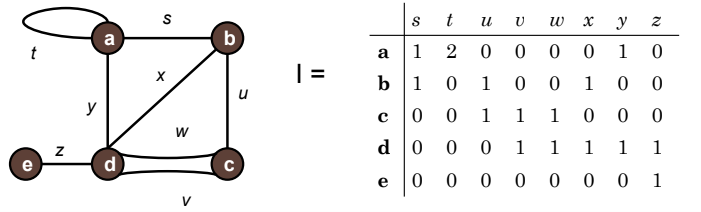

<h1 align="center">Grafos</h1>
 

Gustavo Rodrigues Barcelos

---

<h2>Introdução</h2>

Formalmente, um grafo é uma colecção de vértices e uma colecção de arestas
  constituídos por pares de vértices.
  É uma estrutura usada para representar um modelo em que
  existem relações entre os objectos de uma certa colecção. Pense nos vértices como “locais“. O conjunto dos vértices é o conjunto de todos
  os locais possíveis.
   Nesta analogia, as arestas (ou arcos) representam caminhos entre estes locais.
  O conjunto todo representa todas as ligações entre os locais.

Grafos podem ter inúmeras aplicações no dia a dia de cada pessoa, diversas situações
podem ser representadas e analisadas por meio de grafos, por exemplo:
Os movimentos de um cavalo num tabuleiro de xadrez,uma rede de estradas e redes de computadores
 são situações comuns que podem ser abstraidas em grafos.

 
De maneira mais práticas usamos grafos para:

 <ul>
   <li>Minimizarem o tempo das ligações das linhas de metrô em uma cidade grande.</li>
   <li>Distribuição de correio, minimizando percursos de forma a optimizar as deslocações, tanto para um único carteiro como para uma equipa (o mesmo se aplica a empresas de distribuição).</li>
   <li>Nos GPS buscando melhores rotas para seu destino.</li>
 </ul>

 <h4 align="center">Representações visuais</h4>
  
 

   
   
 

 

   
   
 

  
 <h2>Conceitos Básicos da Teoria de Grafos</h2>

 <h4>Adjacência</h4>
 
Em um grafo simples (G1) dois nós são adjacentes se há pelo menos uma aresta
 que os conecte. Esta aresta é dita ser incidente a ambos.

 No caso de um grafo (G2) ser ordenado a adjacência é especializada em:

 <ul>
   <li>Sucessor: um vértice W é sucessor de V se há uma aresta que parte de V e chega em w.</li>
   <li>Antecessor: um vértice V é antecessor de W se há uma aresta que parte de V e chega em W.</li>
 </ul>

 <h4>Laços</h4>
 <table>
   <tr>
     <td>Um laço é uma aresta ou arco do tipo a=(v,v), ou seja, que relaciona um vértice a ele próprio.</td>
     <td>  </td>
   </tr>
 </table>

 <h4>Grafos Densos</h4>
 
Se um grafo apresenta muitas conexões esse é classificado como denso.
 Nessa classificação o conjunto |E| de arestas é próximo de |V|².

 <h4>Grafos Esparsos</h4>
 
 Quando o conjunto |E| é muito menor que |V|² o grafo é classificado como esparso.

 
<h2>Representações</h2>

Existem muitas formas de abstrair a ideia de grafos em códigos, muitas possibilidades
de armazenar dados nesse tipo de estrutura. As mais habituais são: Lista de adjacências,
Matriz de adjacências, Matriz de incidências.

Comparativo entre essas formas de exibição:

<table align="center">
  <thead>
    <td></td>
    <th>Lista de Lista de adjacências</th>
    <th>Matriz de adjacências</th>
    <th>Matriz de incidências</th>
  </thead>
  <tbody>
    <tr>
      <td>Espaço</td>
      <td align="center">O( |V|+|E| )</td>
      <td align="center">O( |V| 2 ) </td>
      <td align="center">O( |V| . |E| )</td>
    </tr>
    <tr>
      <td>Adicionar Vértice</td>
      <td align="center">O( 1 )</td>
      <td align="center">O( |V| 2 ) </td>
      <td align="center">O( |V| . |E| )</td>
    </tr>
    <tr>
      <td>Adicionar Aresta</td>
      <td align="center">O( |V|+|E| )</td>
      <td align="center">O( 1 ) </td>
      <td align="center">O( |V| . |E| )</td>
    </tr>
    <tr>
      <td>Remover vértice</td>
      <td align="center">O( |E| )</td>
      <td align="center">O( |V| 2  ) </td>
      <td align="center">O( |V| . |E| )</td>
    </tr>
    <tr>
      <td>Remover Aresta</td>
      <td align="center">O( |V| )</td>
      <td align="center">O( 1 ) </td>
      <td align="center">O( |V| . |E| )</td>
    </tr>
  </tbody>
</table>

<h4>Lista de adjacências</h4>

Nesse tipo de representação a ideia é armazenar quais são as arestas incidentes
de um determinado vértice. De maneira estática um único vetor com tamanho pré-definido
pode armazenar esse dados. De forma dinâmica uma lista simplesmente é o bastante.

<ul>
  <li>Principal Vantagem: Baixo Desperdício de Memória</li>
  <li>Principal Desvantagem: Para verificar se dois vértices são adjacentes necessitamos de percorrer todos os vértices adjacentes a um deles (pior caso). </li>
</ul>

  

Struct para representação de cada nó:

~~~c
struct GrafoLA{
   int key; // Conteúdo Armazenado
   int V; // Numero de vétices adjacentes
   int A; // Número de Arestas incidentes
   Lista *adj; //Endereços para os demais Vértices
};
~~~

*Lista está inclusa em "Lista.h" 

<h4>Matriz de adjacências</h4>

Esse tipo de representação consiste em uma matriz N x N, onde N é o número
de vértices do grafo e cada posição (i,j) da matriz representa se há ou não ligação
entre os vétices indicado pela coluna e pela linha. Se o contúdo da posição for
1, significa que existe ligação senão não há ligação.

<ul>
  <li>Principal Vantagem: Facilidade de implementação e compreensão </li>
  <li>Principal Desvantagem:Elevado desperdício de memória (especialmente se o grafo for disperso). </li>
</ul>

  

~~~c
struct GrafoMA{
   int key; // Conteúdo Armazenado
   int V; // Numero de vétices adjacentes
   int A; // Número de Arestas incidentes
   int **adj;
};
~~~

<h4>Matriz de incidências</h4>

Esse tipo de representação consiste em uma matriz M x N, onde N é o número
de vértices (Linha) e M o número de arestas (Coluna) do grafo e cada posição (i,j) da matriz representa se há ou não incidencia
da aresta no vétice indicado.

Em grafos simples caso haja incidência será representado com 1, caso contrario como 0.

<ul>
  <li>Das demais estruturas essa é a menos utilizada, mas não deixa de ser uma excelente opção para grafos densos</li>
</ul>

  

~~~c
struct GrafoMI{
   int key; // Conteúdo Armazenado
   int V; // Numero de vétices adjacentes
   int A; // Número de Arestas incidentes
   int **adj;
};
~~~

<h2>Referencias</h2>
<a href="https://www.revista-programar.info/artigos/grafos-1a-parte/">https://www.revista-programar.info/artigos/grafos-1a-parte/</a>
<a href="https://pt.wikipedia.org/wiki/Grafo_(tipo_de_dado_abstrato)">https://pt.wikipedia.org/wiki/Grafo_(tipo_de_dado_abstrato)</a>
<a href="https://www.ime.usp.br/~pf/algoritmos_para_grafos/aulas/graphdatastructs.html#sec:adjlists">https://www.ime.usp.br/~pf/algoritmos_para_grafos/aulas/graphdatastructs.html#sec:adjlists</a>
