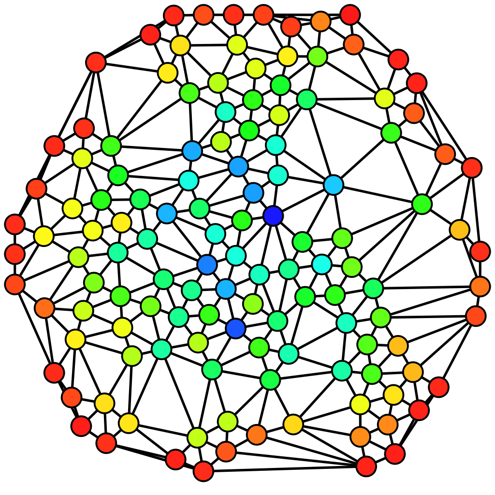

<h1 align="center">Grafos</h1>
 

Gustavo Rodrigues Barcelos

---

<h2>Introdução</h2>

Formalmente, um grafo é uma colecção de vértices e uma colecção de arestas
  constituídos por pares de vértices.
  É uma estrutura usada para representar um modelo em que
  existem relações entre os objectos de uma certa colecção. Pense nos vértices como “locais“. O conjunto dos vértices é o conjunto de todos
  os locais possíveis.
   Nesta analogia, as arestas (ou arcos) representam caminhos entre estes locais.
  O conjunto todo representa todas as ligações entre os locais.

Grafos podem ter inúmeras aplicações no dia a dia de cada pessoa, diversas situações
podem ser representadas e analisadas por meio de grafos, por exemplo:
Os movimentos de um cavalo num tabuleiro de xadrez,uma rede de estradas e redes de computadores
 são situações comuns que podem ser abstraidas em grafos.

 
De maneira mais práticas usamos grafos para:

 <ul>
   <li>Minimizarem o tempo das ligações das linhas de metrô em uma cidade grande.</li>
   <li>Distribuição de correio, minimizando percursos de forma a optimizar as deslocações, tanto para um único carteiro como para uma equipa (o mesmo se aplica a empresas de distribuição).</li>
   <li>Nos GPS buscando melhores rotas para seu destino.</li>
 </ul>

 <h4 align="center">Representações visuais</h4>
  
 

   
   
 

 

   
   
 

 
<h2>Conceitos Básicos da Teoria de Grafos</h2>

<h4>Adjacência</h4>

Em um grafo simples (G1) dois nós são adjacentes se há pelo menos uma aresta
que os conecte. Esta aresta é dita ser incidente a ambos.

No caso de um grafo (G2) ser ordenado a adjacência é especializada em:

<ul>
  <li>Sucessor: um vértice W é sucessor de V se há uma aresta que parte de V e chega em w.</li>
  <li>Antecessor: um vértice V é antecessor de W se há uma aresta que parte de V e chega em W.</li>
</ul>

<h4>Laços</h4>
<table>
  <tr>
    <td>Um laço é uma aresta ou arco do tipo a=(v,v), ou seja, que relaciona um vértice a ele próprio. Em G3 há três ocorrências de laços para um grafo não orientado.</td>
    <td></td>
  </tr>
</table>
